====================
Introduction to Iris
====================

In this section we will explore the capabilities of Iris via the
Cubeviz graphical user interface.

Cubeviz
-------

Cubeviz is a lightweight visulisation tool designed for use with Iris
and Cartopy. It allows you to quickly and easily load a file, and then
view plots of the cube data that is contained within it.

You are able to select which cube from the file you would like to plot,
and, for cubes with more than two dimensions, you are able to choose to
plot any 2D slice of the cube.

Further, you have numerous options regarding how the cube will be plotted,
from the type of graph, to drawing coastlines.

For hints whilst using the Cubeviz program, hold your mouse over the
relevant section to produce a tool tip describing its function.

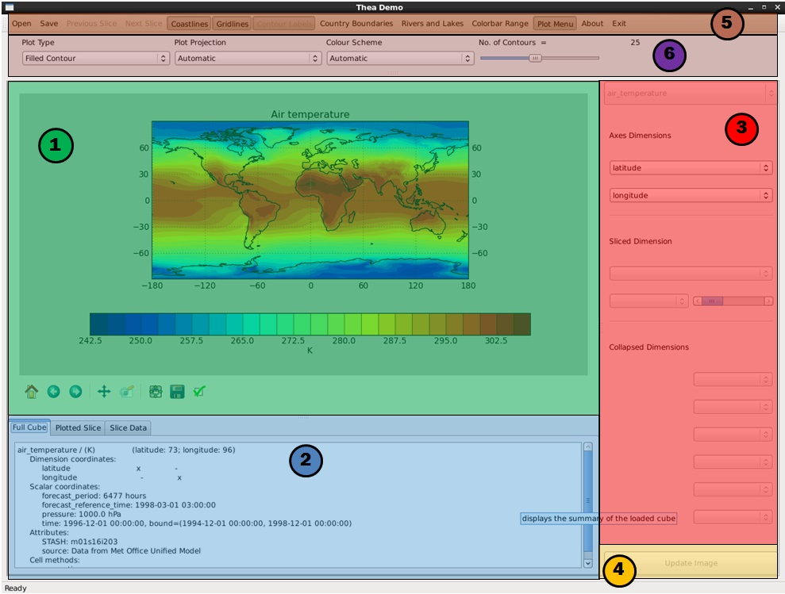

The main window can be broken down into a few main segments

 1. Embedded Matplotlib Display: Where the plot is displayed.
 2. Cube Information: Displays a summary of the cube and the slice,
    and shows the data within the slice.
 3. Cube Menu: Allows selection of which slice is plotted.
 4. Update Button: Replots the cube.
 5. Toolbar: Numerous Actions such as open and save.
 6. Plot Menu: Allows selection of how the cube is plotted.

Loading data
------------

We will start with a simple 2D cube which holds data on gloabl air
temperature.

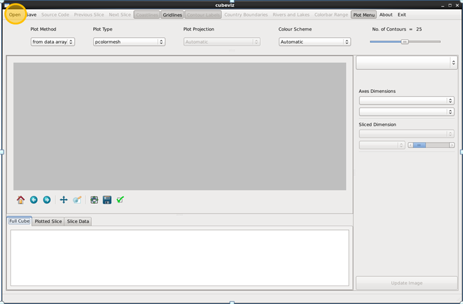

To load the file, simply click on the 'Open' button found at the top left
of the screen. This will open a file browser. From here, navigate to the
'sample_data' folder and select the file named 'A1B.2098.pp'.

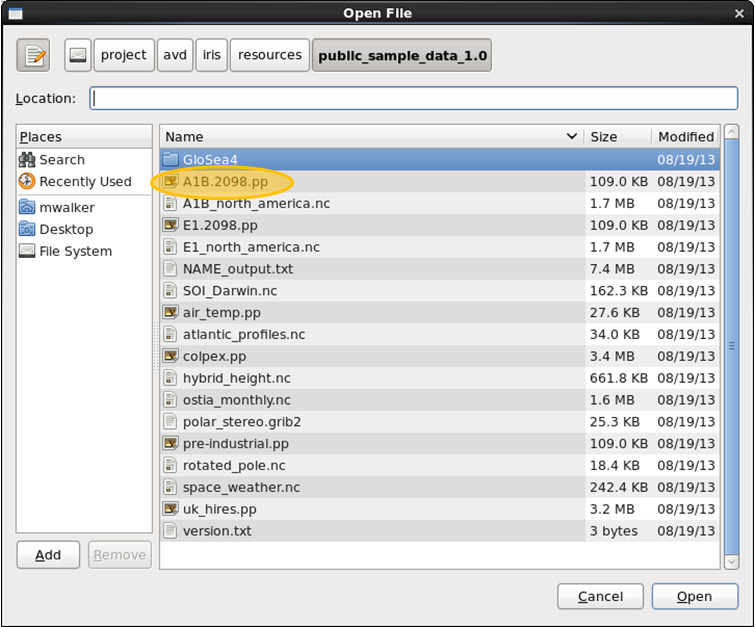

The cube is plotted on the left of your screen. On the right, you will see
the axes dimension boxes and the select cube box have been filled, but not
the Sliced Dimension box. This is because the cube has only two dimensions.

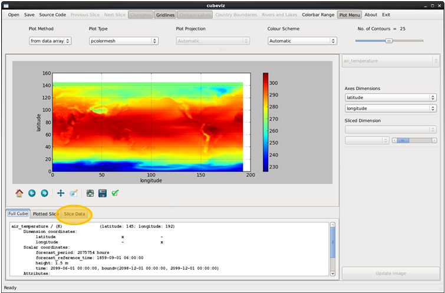

If you look at the bottom left of the window, you will be able to see a
summary of the cube. You are currently in the Full Cube tab. This will
show you the summary of the cube you have loaded. You can switch to the
Sliced Cube tab by clicking on the tab, however you will notice that there
is no change to the cube summary. This is because this cube has only two
dimensions and so does not need to be sliced before plotting.

Click on the slice data tab to show a table containing the data contained
within the currently plotted slice.

Changing the plot type
----------------------

Changing the plot type is simple. Just click on the drop down list labeled
Plot Type, and select the type of plot you would like.

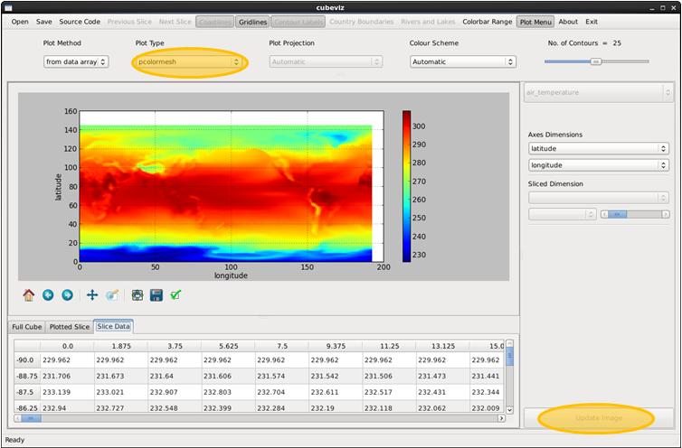

After having made any changes, you will need to click update (or hit your
'Enter' key) before the plot will be redrawn with the new options.

Picking a color scheme
----------------------

The image below illustrates selecting a colour scheme for your plot. The
application currently uses the brewer color palletes that are compatible
with Iris.

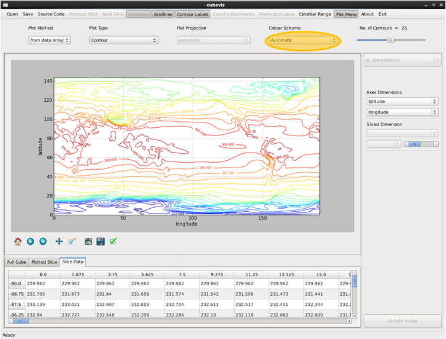

Iris quickplot
--------------

So far, we have not been using any of the Iris plotting tools. Instead, we
have simply been plotting the raw data from the cube. Next we will switch
to using Iris' Quickplot for creating the images.

This can be done by clicking on the plot method button and selecting 'using
quickplot' from the drop down list. Click update to replot the graph.

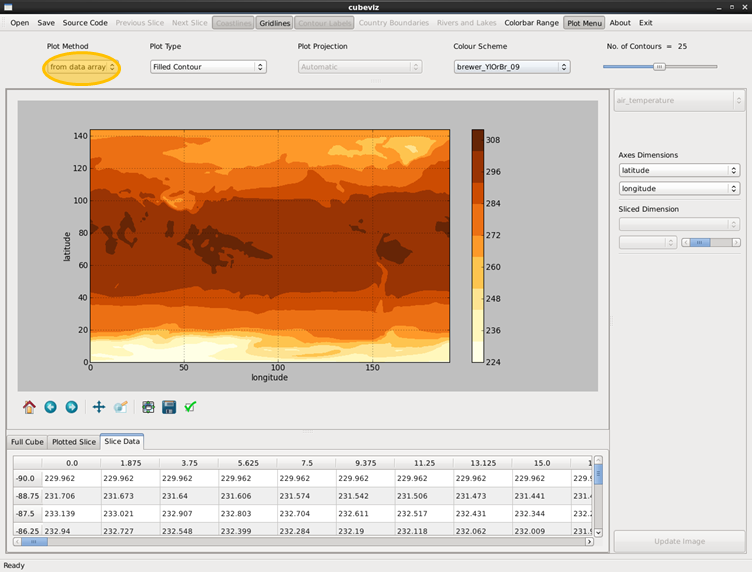

Contours, coastlines and more
-----------------------------

Now that we are using quickplot, you will notice that there are more options
enabled in the toolbar. The ones availiable for this cube are coastlines,
country boundaries, rivers and lakes and contour labels if the plot type is
Contour.

You also have the option to change the number of contours plotted using
the slider.

Try turning these options on and off now to get a feel for them (remember
that you will need to click update before the plot is redrawn).

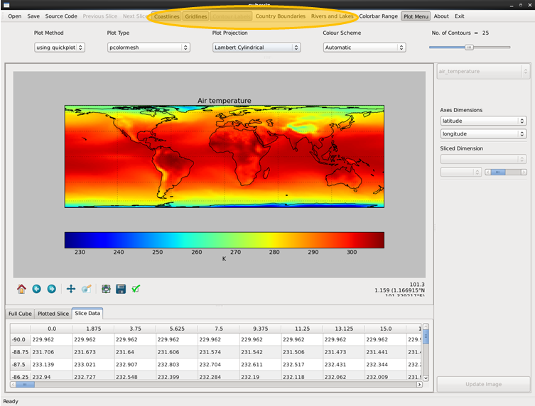

Choosing the projection
-----------------------

Click on the Select Projection box to change the display projection.

.. note::

   The Cartopy plotting engine, originally developed for Iris, is still a
   relatively new project. The implementation of some projections is
   currently tempremental, therefore some of the available projections
   have been temporarily removed from Cubeviz.

   If you find plotting errors when using Cubeviz, please consider raising
   a new bug ticket by clicking the green  *New Issue* button on the `Cartopy
   issues <https://github.com/SciTools/cartopy/issues?state=open>`_ page.

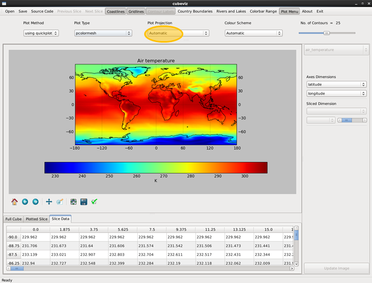

Interacting with the plot
-------------------------

The image plot is rendered using python's matplotlib library, in Cubeviz you
have access to the same matplotlib toolbar which can be found below the image
and provides functionality for zooming, dragging etc.

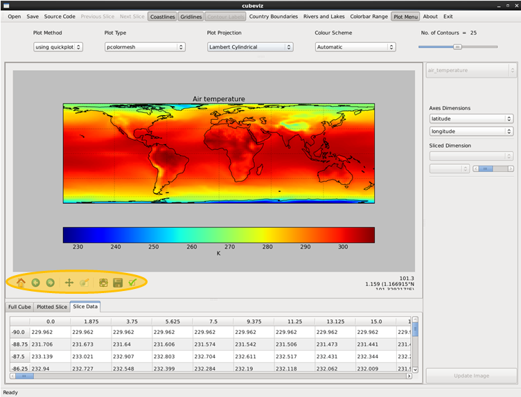

You can save your image either by clicking the save button on the matplotlib
toolbar, or by clicking save on the main toolbar. In both cases
a file browser will open which will allow you to save the image as normal.
You can save the image in numerous formats including png and jpeg.

More complex cubes
------------------

In this next example, we are going to load a four dimensional cube. Following
the same method as before, this time load the 'A1B north america.nc' file.

If we now look at the cube information section, and flick between the tabs,
we can see that there is now a difference between the full cube and cube slice
summaries.

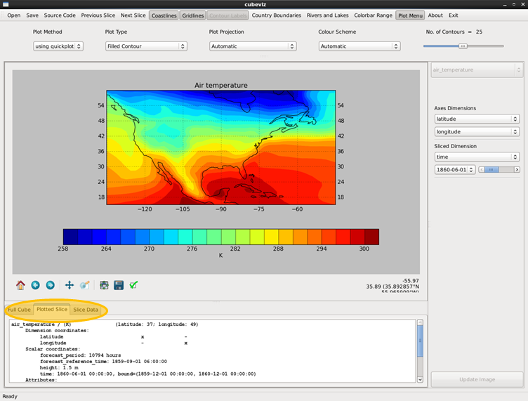

Looking closer at the Sliced Cube tab, we can see that the Axes Dimensions
correspond to the dimensions of this cube slice, and that the other
two dimensions have been collapsed down to the value shown on the boxes
(although if the coordinate is time then there may be differences as Iris
transforms the time values). We can now try changing the Axes dimensions.
Click on the latitude axes dimension and change it to be time. Now click
update (or press your Enter key) to plot the new graph.

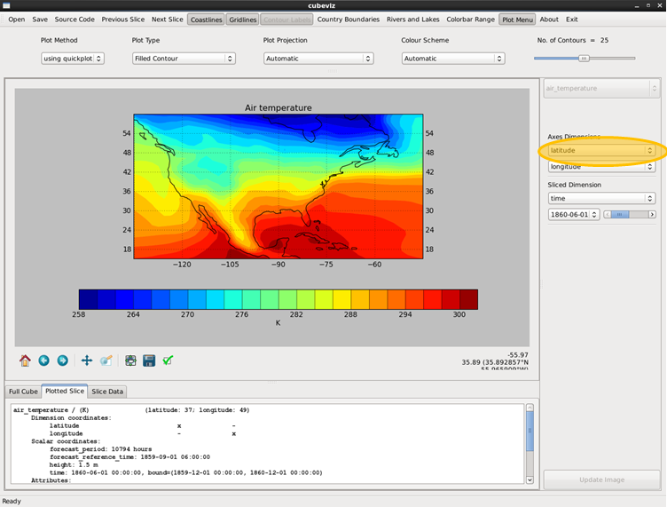

Notice that now many of the options have been removed. For example
you now cannot plot coastlines or change the projection. This is because the
plot is no longer a lat/lon plot, so these options would make no sense.

Stepping through a dimension
----------------------------

To move through the slices, you can either select the slice you would like
to see using the slider or the drop down list, or you can use the next and
previous slice buttons (shortcuts 6 and 4) to step through the slices.

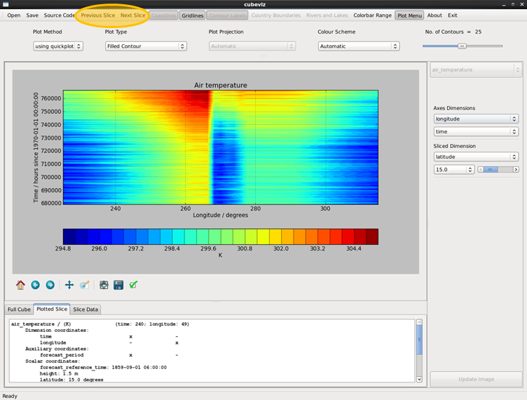

Setting the colorbar
--------------------

As you are moving through the slices, you may have noticed that for every
new slice, the colorbar updates. This makes it difficult to compare between
the slices, as red in one slice may not be the same temperature as red in any
other slice.

To change this, click on the Colorbar Range button.

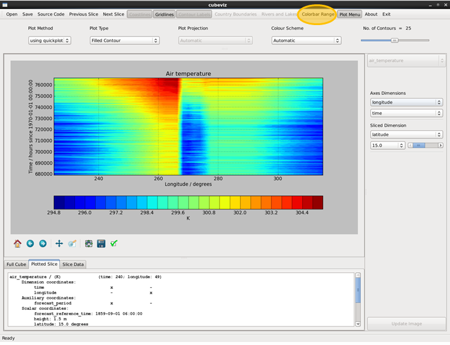

This will open a new window. In this window, check the box next to Fix
across all Slices. You will notice that the values in the max and min boxes
will change.

Closing this and again moving through the slices, you will notice that it
is now much easier to compare between slices, as a particular color will now
always correspond to the same values in the data.

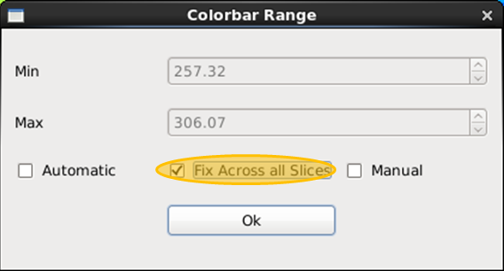

Cubeviz has scaned through all of the slices, and set red to
be the maximum value across all of the slices, and blue to be the minimum
across all of the slices.

You are also able to specify your own range for the colorbar by clicking
the manual botton in the Colorbar Range window and then changing the
max and min values. Try this now a see what effect this has.

Selecting a cube from a file
----------------------------

Some files may contain more than one cube, try opening a four dimensional
cube such as the 'uk hires.pp' found in the Iris Sample Data folder.

Looking at the Select Cube box, you will see that unlike in the last example,
this box is now enabled. Click it, and you will see that you now have a choice
of the 2 cubes contained within this file (remembering still that the update
button must be pressed before the graph will be redrawn)

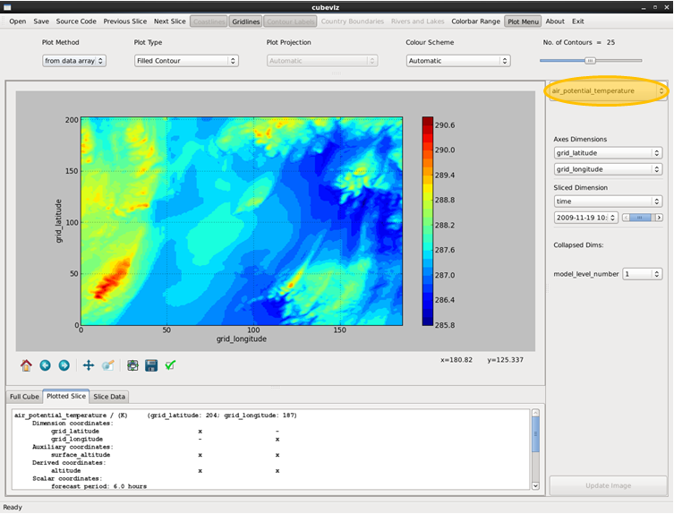

Working with collapsed dimensions
---------------------------------

Switch back to the air potential temperature cube. You should now be able
to see that we have filled one of our collapsed dimension slots. Checking the
Cube Slice tab, you will see that the cube has been collapsed down onto the
value specified next to the collapsed dimension name.

To change this value, simply select a new one from the drop down list.
To change which dimenions are collapsed, just pick the dimensions that
you would like to plot as before.

Iris source code
----------------

Cubeviz is a GUI that uses the Iris python library. In the rest of this
tutorial we will be working directly with the python command line interpreter
and issuing python commands. A useful feature of Cubeviz is that, for any
plot output, you can see the python commands that are needed to construct the
plot by clicking on the Source Code menu item.

.. admonition:: Exercise

   Work through this section of the tutorial again and review the python
   commands that are used to generate each plot by clicking on the 'Source
   Code' menu item.

   For each example, look at the commands in turn and work out what each
   section of the code does.

   To try out any of the code directly in python, navigate to *Applications* >
   *Accessories* > *Terminal Emulator* in the Ubuntu Desktop menus, type
   **python** to start the python interpreter, and then paste the source code
   into this window to replicate the same plot output.

