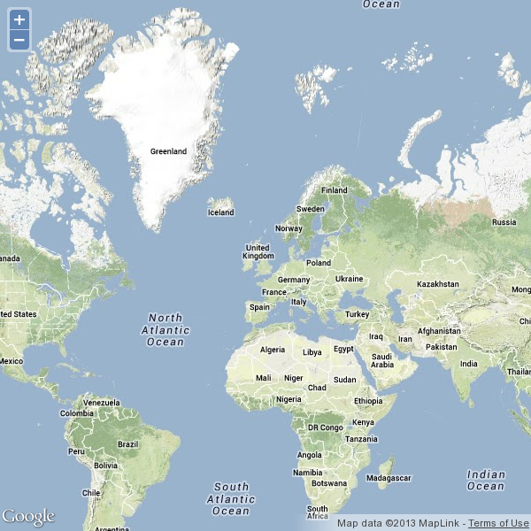
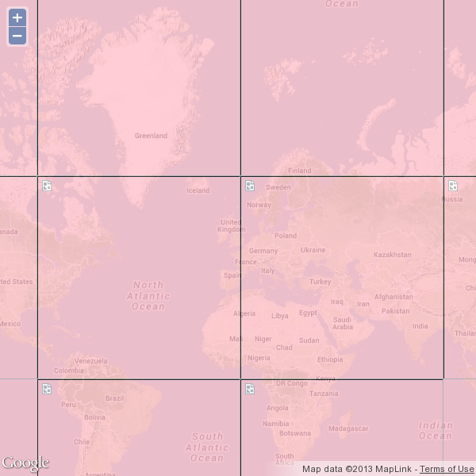
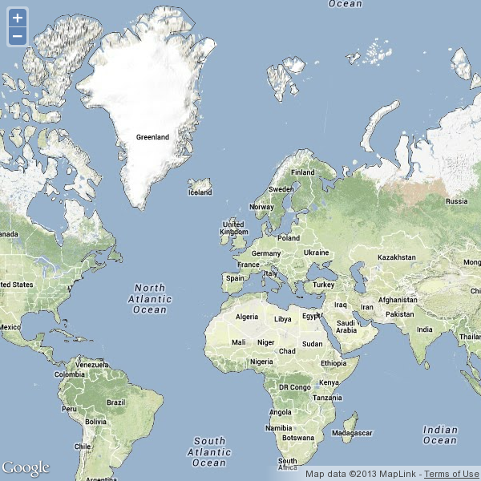
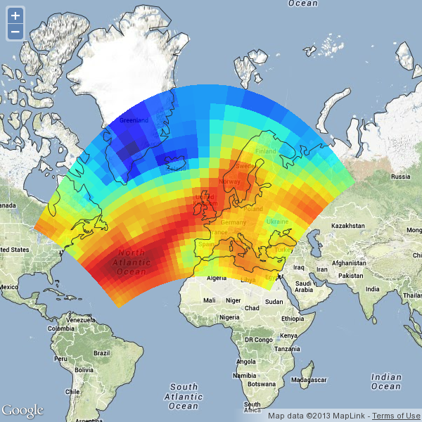
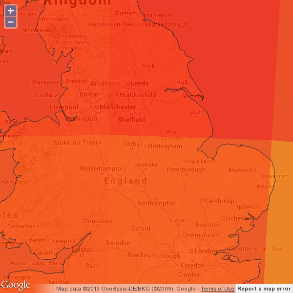

===================================
Iris, OpenLayers, and a tile server
===================================

In this section you will see how to build a simple tile server which
will render Iris data on demand. You will also integrate this content
with Google map imagery using OpenLayers.

Before you get started, create a directory for your files and set it as
your current directory.

.. code-block:: none

    $ mkdir -p /home/user/iris_workshop/tile_server
    $ cd /home/user/iris_workshop/tile_server

Using OpenLayers
----------------

Thanks to the OpenLayers and Google Maps JavaScript libraries, creating
an interactive web page containing a "slippy map" can be done with a
single page of code:

First, create an HTML document called `map.html`.

The very first line of this document should declare a doctype. To use
HTML5 (for consistent, cross-browser support) the doctype needs to be:

.. literalinclude:: ../solutions/tile_server/map.html
   :language: html
   :lines: 1

Within the `<head>` element of the document you need to include the
OpenLayers and Google Maps JavaScript libraries:

.. literalinclude:: ../solutions/tile_server/map.html
   :language: html
   :lines: 5-10

Within the `<body>` element you need to define a place-holder for the
final map. This place-holder should have a value for the `id` attribute
which you will pass to OpenLayers to allow it to find it.

.. literalinclude:: ../solutions/tile_server/map.html
   :language: html
   :lines: 35

Also within the `<head>` element you need to defined a `<script>`
element containing a JavaScript function which will create the map.
This function needs to construct an `OpenLayers.Map` instance using the
`id` of the place-holder element and an options object. The options
object needs to set the `projection` attribute to the map projection
used by Google Maps (known as 'EPSG:3857'), and the `layers` attribute
to a list of layer objects. The code below shows how to create a layer
which uses the physical relief tiles from Google Maps. The other
available types are: ROADMAP, SATELLITE, and HYBRID.

.. literalinclude:: ../solutions/tile_server/map.html
   :language: javascript
   :lines: 12-18,24-31

Finally, you should arange for the your JavaScript function to be
called once the page has finished loading, by using the `onload` event
on the `<body>` element.

.. literalinclude:: ../solutions/tile_server/map.html
   :language: html
   :lines: 34

In total, your document should look something like:

.. literalinclude:: ../solutions/tile_server/map.html
   :language: html
   :lines: 1-18,24-26,32-

Check this is working correctly by pointing your web browser at:
    file:///home/user/iris_workshop/tile_server/map.html

You should see a page containing the following map:

Now you can add the description of an Iris-based layer to the `layers`
list.

.. literalinclude:: ../solutions/tile_server/map.html
   :language: javascript
   :lines: 20-24

Your completed web page should look like
:doc:`this <open_layers_resources/map>`.

Reload the map in your browser and you will see:

OpenLayers displays all the pink tiles to indicate it is unable to
retrieve the tiles from the given location. Obviously that's because
the tile server doesn't exist yet...

The tile server
---------------

For this example you will use the `Tornado <www.tornadoweb.org>`_ web
server to handle the low level HTTP interface. But in your own
deployments you could equally use an alternative web server.

Cartopy ships with built-in aides for working with Google-style map
tiles. The class `cartopy.io.img_tiles.GoogleTiles` provides:

- a convenient way to access the correct projection definition via the
  `crs` attribute,
- and the `tile_bbox()` method to compute the projection extents for a
  tile specified by its X, Y, and Z indices.

Using these, and a couple of tweaks to ensure Cartopy will correctly
render tiles containing transparency, you can quickly define a tile
server with the following code:

.. literalinclude:: ../solutions/tile_server/tile_server.py
   :lines: 1-39
   :append:
    if __name__ == '__main__':
        tile_server()

.. note::
   
   NB. To make this runnable from the command line this code finishes
   with the standard Python idiom::

    if __name__ == '__main__':
        tile_server()

Create this file as /home/user/iris_workshop/tile_server/tile_server.py
and then execute it from the command line::

    $ cd /home/user/iris_workshop/tile_server
    $ python tile_server.py

After a short pause you should see the output "`Server ready`", after
which you can reload the map page in your browser and you should see
that the pink overlay has gone away.

You will also see a whole load of "`Requested tile: ...`" lines appear
in your terminal. This shows the tile server is responding to tile
requests from the map.

Coastlines
^^^^^^^^^^

At this point your tile server is just serving up empty/transparent
tiles which is not very interesting. What it needs now is some code to
draw something on the cartopy GeoAxes that it provides. To do this you
need to:

- Provide a function to do the drawing which takes a single GeoAxes
  parameter.
- Modify the call to the `tile_server()` function to pass your draw
  function.

For example:

.. code-block:: python

    def draw(geoaxes):
        # ... draw stuff to the geoaxes ...

    if __name__ == '__main__':
        tile_server(draw)

A simple starting point for doing some drawing is to add coastlines via
cartopy's `coastlines()` method:

.. code-block:: python

    def draw(geoaxes):
        geoaxes.coastlines('110m')

By asking for 1:110 million scale coastlines, this will add some
relatively low resolution coastlines, as defined by
http://naturalearthdata.com/. Restart your tile server, and reload the
map page in your web browser and the coastlines should be visible. You
will see how to improve their quality later in this tutorial.

Gridded data
^^^^^^^^^^^^

Now it's time to add some gridded data to the tile server output. For
this you can use Iris to load some data and plot it. One of the benefits
of using Iris is that it will automatically pass the appropriate
projection parameters to cartopy to ensure the data is rendered
correctly.

To get started, you can use the `iris.sample_data_path()` function to
obtain the file path for some suitable data. But you could easily change
this to load another dataset of your choice. If you do decide to load a
different dataset, take care to ensure you have a data selection which
is suitable for a map (i.e. horizontal and two-dimensional) before
attempting to plot it.

Having loaded some appropriate data, you can plot it using the
functions in the `iris.plot` module. The `pcolormesh()`, `contour`, and
`contourf` functions are very good starting point.

You'll need to add something like the following to your `draw()`
function.

.. code-block:: python

    import iris
    import iris.plot as iplt

    fname = iris.sample_data_path('rotated_pole.nc')
    temperature = iris.load_cube(fname)
    iplt.pcolormesh(temperature)

As before, restart your file server and reload the map page to see the
changes.

Going the extra mile
^^^^^^^^^^^^^^^^^^^^

Finally, it is possible to increase the resolution of the coastlines by
changing the argument supplied to the `coastlines()` method. The other
permissible values are '50m' and '10m', to select 1:50 million and
1:10 million scale coastlines respectively.

NB. The extra detail in the coastlines requires much more computation to
reproject them for use on the map. This will cause a significant pause
when they are first rendered. To avoid this pause being visible to the
first end user to request a tile from the server, you can force the
server to do the work when it first starts up by including a call to
`plt.draw()` within your `draw()` function.

.. code-block:: python

    geoaxes.coastlines('10m')

    plt.draw()

After reloading the map in your browser the increased coastline
resolution will only become truly apparent when you zoom in.

Your complete tile server should look something like
:doc:`this <open_layers_resources/tile_server>`.

