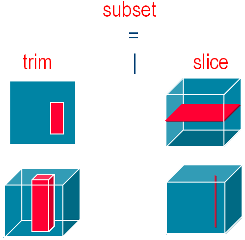

=====================
Challenges of WCS 2.0
=====================

The OGC Web Coverage Service (WCS) defines a useful standard for retrieving
subsets of 'raw' data from big data archives [#f1]_. As large multi-dimensional
datasets becomes more common, the requirement for WCS 2.0 support will become
more widespread.

With the addition of CF-NetCDF [#f2]_ as a supported data transport mechanism,
along with the software tools presented in this workshop, standards
implementers, developers and users now have a powerful combination of software
and standards for building systems that work with big data.

When considering the application of the WCS 2.0 standard a number of challenges
emerge at varying levels of implementation.

- Standard implementers - for server software to implement trim and slice
  operations on complex multi-dimensional data sets, specialist data models
  and software are required
- Service developers - when developing services that make use of big data,
  the most efficient implementations need to be delivered
- Users - when multi-dimensional data is returned, users require specialist
  tools that allow them to efficiently work with the received data

These challenges can be addressed by Iris - an open source software library
that has been developed specifically to work with multi-dimensional data and
can be applied with equal success on both the server and client.

The WPS option
--------------

- WCS - Move the data to where the processing occurs (client)
- WPS - Moving the processing to where the data exists (server)

Imagine that you have an algoritm that determines the maximum value in any
given dataset by looping over all values and recording the maximum that is
found. To apply this process to big data via WCS would first require you
to download the entire dataset. But, by moving the process to the server, and
making a request via WPS the algorithm can be executed where the data resides,
and only the result of the operation needs to be transmitted over a network.

Often, processes that work on very large datasets return results that are
smaller in volume then the original input data.

Utilising Iris
--------------

The open source Iris python package is a useful library to consider both for
implementating, and for working with, WCS and WPS services, as well as being a
valuable scientific analysis and visualisation environment for use on the
desktop.

In this workshop We will look in detail at various examples of integrating
Iris with other software on OSGeo Live, before culminating with
an example of using Iris with ZOO-Project to deliver WPS services.

.. rubric:: Footnotes

.. [#f1] http://www.ogcnetwork.net/wcs
.. [#f2] http://cf-pcmdi.llnl.gov
