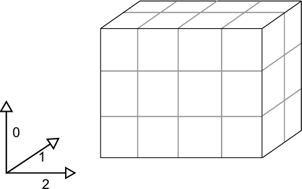

=================
What is Big Data?
=================

There is currenly no commonly accepted definition of "big data", but data
receiving this label tends to have a combination of the following
characteristics [#f1]_:

- Volume - Large amounts of data are stored and analysed
- Variety - Multiple types of data - possibly from multiple sources
- Velocity - Data produced at high rates

Types of big data
-----------------

In this workshop we will explore large multi-dimensional datasets such as
those found in the fields of weather and climate science, and also introduce
data models and tools designed specifically to work with these data.

Note that we'll be working with dense, gridded, numerical data. In contrast,
other types of big data may be very sparse, or may consist of large volumes
of text or other data amalgamated from different sources.

Iris: A tool for working with big data
--------------------------------------

Iris is a powerful, easy to use, and community-driven Python library for
analysing and visualising multi-dimensional data sets.

With Iris you can:

 - Use a single API to work on your data, irrespective of its original format.
 - Read and write (CF-)netCDF, GRIB, PP and other file formats.
 - Easily produce graphs and maps via integration with matplotlib and cartopy.

During the development of Iris, a second package called Cartopy was also
created. Cartopy is a Python package designed to make drawing maps for data
analysis and visualisation as easy as possible.

Cartopy makes use of the powerful PROJ.4, numpy and shapely libraries and has
a simple and intuitive drawing interface to Python's matplotlib for creating
publication quality maps.

Cartopy contains:

 - Object oriented projection definitions
 - Point, line, polygon and image transformations between projections
 - Integration with matplotlib to expose advanced mapping through a simple
   and intuitive interface
 - Powerful vector data handling by integrating shapefile reading with
   Shapely's capabilities

In this workshop we will make use of both Iris and Cartopy.

.. Note::

   The rest of this section descibes the Iris data model in some detail.
   Don't worry if this does not all make sense at this stage, just skim
   through the material and then continue with the rest of the workshop
   to get a better feel for how the software works.

Iris data structures
--------------------

The top level object in Iris is called a cube. A cube contains data and 
metadata about a phenomenon.

In Iris, a cube is an interpretation of the *Climate and Forecast (CF)
Metadata Conventions* whose purpose is to:

    *require conforming datasets to contain sufficient metadata that they
    are self-describing... including physical units if appropriate, and
    that each value can be located in space (relative to earth-based
    coordinates) and time.*

Iris implements several major format importers which can take files and
turn them into Iris cubes. Additionally, a framework is provided
which allows users to extend Iris' import capability to cater for specialist
or unimplemented formats.  

A single cube describes one and only one phenomenon, always has a name, a
unit and an n-dimensional data array to represents the cube's phenomenon.
In order to locate the data spatially, temporally, or in any other
higher-dimensional space, a collection of *coordinates* exist on the cube.

Coordinates
-----------

A coordinate stores metadata about some dimension(s) of
a cube's data array and therefore, by definition, its phenomenon.

 * Each coordinate has a name and a unit.
 * When a coordinate is added to a cube, the data dimensions that it
   represents are also provided.

    * The shape of a coordinate is always the same as the shape of the
      associated data dimension(s) on the cube.
    * Each dimension of a coordinate must be mapped to a data dimension.
      The only coordinates with no mapping are scalar coordinates.
      
 * Depending on the underlying data that the coordinate is representing,
   its values may be discrete points or be bounded to represent interval
   extents (e.g. temperature at *point x* **vs** rainfall accumulation
   *between 0000-1200 hours*).
 * More complex coordinates may contain a coordinate system which is
   necessary to fully interpret the values contained within the coordinate.
   
A *dimension coordinate* must be numeric and monotonic (always increasing or
decreasing), and must represent, at most, a single data dimension (1d).

Alternatively, an *auxiliary coordinate* may be of any type, including strings
and may represent multiple data dimensions (n-dimensional)
 

Cubes
-----

Meta data is very important when working with big data, and this is reflected
both in the CF-conventions, and in the Iris data model.

A cube consists of:

 * a standard name and/or a long name and an appropriate unit
 * a data array who's values are representative of the phenomenon
 * a collection of coordinates and associated data dimensions on the cube's
   data array, which are split into two separate lists:

    * *dimension coordinates* - DimCoords which uniquely map to exactly one
      data dimension, ordered by dimension.
    * *auxiliary coordinates* - DimCoords or AuxCoords which map to as many
      data dimensions as the coordinate has dimensions.
   
 * an attributes dictionary which can hold arbitrary extra metadata.
 * a list of 'cell methods' to represent operations which have already been
   applied to the data (e.g. "mean over time") 
 * a list of coordinate "factories" used for deriving coordinates from the
   values of other coordinates in the cube 

A simple cube example
---------------------

Suppose we have some gridded data which has 24 air temperature readings
(in Kelvin) which is located at 4 different longitudes, 2 different latitudes
and 3 different heights. Our data array can be represented pictorially: 

Where dimensions 0, 1, and 2 have lengths 3, 2 and 4 respectively.

The Iris cube to represent this data would consist of:

 * a standard name of ``air_temperature`` and a unit of ``kelvin``
 * a data array of shape ``(3, 2, 4)``
 * a coordinate, mapping to dimension 0, consisting of:
 
    * a standard name of ``height`` and unit of ``meters``
    * an array of length 3 representing the 3 ``height`` points
      
 * a coordinate, mapping to dimension 1, consisting of:
 
    * a standard name of ``latitude`` and unit of ``degrees``
    * an array of length 2 representing the 2 latitude points
    * a coordinate system such that the ``latitude`` points could be fully 
      located on the globe
    
 * a coordinate, mapping to dimension 2, consisting of:
 
    * a standard name of ``longitude`` and unit of ``degrees``
    * an array of length 4 representing the 4 longitude points
    * a coordinate system such that the ``longitude`` points could be fully
      located on the globe   
    

Pictorially the cube has taken on more information than a simple array: 

.. image:: images/multi_array_to_cube.png

Additionally further information may be optionally attached to the cube. 
For example, it is possible to attach any of the following: 

 * a coordinate, not mapping to any data dimensions, consisting of:
  
    * a standard name of ``time`` and unit of ``days since 2000-01-01 00:00``
    * a data array of length 1 representing the time that the data array is
      valid for
    
 * an auxiliary coordinate, mapping to dimensions 1 and 2, consisting of:
    
    * a long name of ``place name`` and no unit
    * a 2d string array of shape ``(2, 4)`` with the names of the 8 places
      that the lat/lons correspond to
    
 * an auxiliary coordinate "factory", which can derive its own mapping,
   consisting of:
   
    * a standard name of ``height`` and a unit of ``feet``
    * knowledge of how data values for this coordinate can be calculated given
      the ``height in meters`` coordinate
    
 * a cell method of "mean" over "ensemble" to indicate that the data has been
   meaned over a collection of "ensembles" (i.e. multiple model runs).

Printing a cube
===============

Every Iris cube can be printed to screen as you will see later in this
tutorial. It is worth familiarising yourself with the output as this is the
quickest way of inspecting the contents of a cube. Here is the result of
printing a real life cube:

.. code-block:: python

    air_potential_temperature / (K)     (time: 3; model_level_number: 7; grid_latitude: 204; grid_longitude: 187)
         Dimension coordinates:
              time                           x                      -                 -                    -
              model_level_number             -                      x                 -                    -
              grid_latitude                  -                      -                 x                    -
              grid_longitude                 -                      -                 -                    x
         Auxiliary coordinates:
              forecast_period                x                      -                 -                    -
              level_height                   -                      x                 -                    -
              sigma                          -                      x                 -                    -
              surface_altitude               -                      -                 x                    x
         Derived coordinates:
              altitude                       -                      x                 x                    x
         Scalar coordinates:
              forecast_reference_time: 2009-11-19 04:00:00
         Attributes:
              STASH: m01s00i004
              source: Data from Met Office Unified Model 7.03

Using this output we can deduce that:

 * The cube represents air potential temperature
 * There are 4 data dimensions, and the data has a shape of ``(3, 7, 204, 187)``
 * The 4 data dimensions are mapped to the ``time``, ``model_level_number``,
   ``grid_latitude``, ``grid_longitude`` coordinates respectively
 * There are three 1d auxiliary coordinates and one 2d auxiliary 
   (``surface_altitude``) 
 * There is a single ``altitude`` derived coordinate, which spans 3 data
   dimensions
 * There are 7 distinct values in the "model_level_number" coordinate. Similar
   inferences can be made for the other dimension coordinates
 * There are 7, not necessarily distinct, values in the ``level_height``
   coordinate
 * There is a single ``forecast_reference_time`` scalar coordinate representing
   the entire cube
 * The cube has one further attribute relating to the  phenomenon. 
   In this case the originating file format, PP, encodes information in a
   'STASH code' which in some cases can be useful for identifying advanced
   experiment information relating to the phenomenon.

.. rubric:: Footnotes

.. [#f1] Categories of big data taken from the Autumn 2013 edition of `IT Now
   <http://itnow.oxfordjournals.org/content/55/3.toc>`_ from the British Computer Society.
