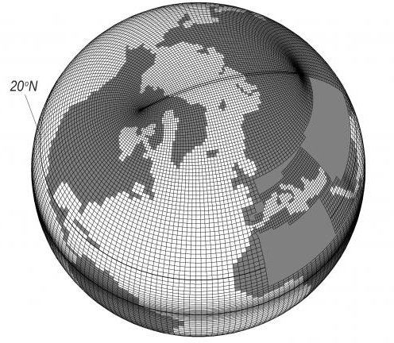

=============
What is Iris?
=============

.. todo::

   Diagram: SciTools box containing logos for Iris, Cartopy and "..."

.. admonition:: Links

   - `scitools.org.uk <http://www.scitools.org.uk>`_
   - `github.com/SciTools <https://github.com/SciTools>`_

Working with unusual grids
--------------------------

The image below shows an example of a tripolar grid used by ocean models [#f1]_. This unusual grid has three poles that are intentionally placed of land masses. This minimises the distortion in the oceans.

.. todo::

   What is NetCDF, What is CF-NetCDF, Is CF relevant outside of 'climate'?
   Climate and Forecasting conventions for NetCDF (CF-NetCDF)

.. rubric:: Footnotes

.. [#f1] http://www.nemo-ocean.eu/About-NEMO/Gallery/Mesh_grey_sphere
